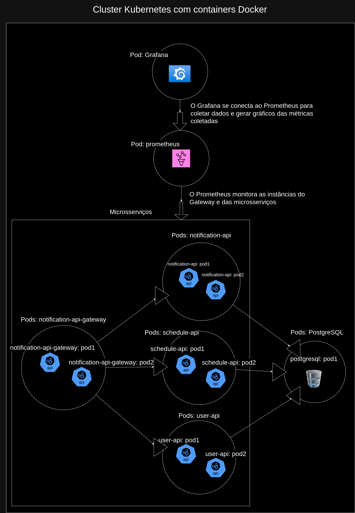

# notification-app

Repositório para o projeto Notification APP

### Sobre o Projeto

A aplicação de notificações é dividida em 3 microssserviços, sendo eles o microsserviço de notificações (notification-api), usuários (user-api), e agendamentos (schedule-api).

### Arquitetura:

Propus uma arquitetura de microsserviços, com o objetivo de diminuir o máximo possível o acoplamento entre os módulos da aplicação, ter também como vantagem a forte separação de responsabilidades, assim como uma maior possibilidade de escalabilidade e resiliência.

Foi utilizado containers do Docker junto com o Kubernetes para realizar os deploys e fazer a escalabilidade da aplicação.

Cada microsserviço se trata de apis Rest, utilizando Java 17, Spring Boot 3, arquitetura de camadas e o design pattern MVC, um scheduler para verificar os agendamentos, além de migrations para facilitar as atualizações do banco de dados. A aplicação conta ainda com um API Gateway para centralizar a documentação das APIs, o security, rotear e distribuir os acessos as mesmas.

Os 3 microsserviços utilizam uma instância do PostgreSQL também disponível como uma instância do Kubernetes. Trata-se de um banco que oferece configurações para escalabilidade, embora, ainda não tenha sido configurado para tal.

Por último, utilizei 2 ferramentas para realizar o monitoramento das aplicações e do ambiente como um todo. Trata-se do Prometheus, que coleta métricas dos microsserviços e do api gateway, e o Grafana, que se conecta ao Prometheus para coletar as métricas e gerar gráficos.

### Autor

    Renato Daniel Santana Santos